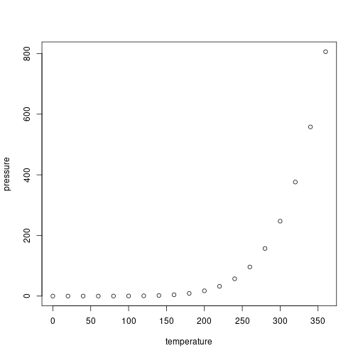

<!-- README.md is generated from README.Rmd. Please edit that file -->


# rapmod

<!-- badges: start -->
[](https://github.com/rapporteket/rapmod/releases)
[](https://github.com/Rapporteket/rapmod/actions)
[](https://codecov.io/github/Rapporteket/rapmod?branch=main)
[](https://CRAN.R-project.org/package=rapmod)
[](https://lifecycle.r-lib.org/articles/stages.html#experimental)
[](https://rapporteket.github.io/rapmod/)
<!-- badges: end -->

This package provides shiny application modules that may be used by registries at [Rapporteket](https://rapporteket.github.io/rapporteket/).

## Installation

Install *rapmod* from CRAN:
```r
install.packages("rapmod")
```

The latest release of the package can be installed from GitHub:
```r
remotes::install_github("Rapporteket/rapmod@*release")
```

Or install the development version from GitHub with:
```r
remotes::install("Rapporteket/rapmod")
```
Alternatively, the package source code can be [cloned from GitHub](https://github.com/Rapporteket/rapmod) and built locally. 

## Example

This is a basic example which shows you how to solve a common problem:


```r
library(rapmod)
export_app()
#> PhantomJS not found. You can install it with webshot::install_phantomjs(). If it is installed, please make sure the phantomjs executable can be found via the PATH variable.
#> Loading required package: shiny
#> 
#> Listening on http://127.0.0.1:8246
#> Error in path.expand(path): invalid 'path' argument
```

What is special about using `README.Rmd` instead of just `README.md`? You can include R chunks like so:


```r
summary(cars)
#>      speed           dist       
#>  Min.   : 4.0   Min.   :  2.00  
#>  1st Qu.:12.0   1st Qu.: 26.00  
#>  Median :15.0   Median : 36.00  
#>  Mean   :15.4   Mean   : 42.98  
#>  3rd Qu.:19.0   3rd Qu.: 56.00  
#>  Max.   :25.0   Max.   :120.00
```

You'll still need to render `README.Rmd` regularly, to keep `README.md` up-to-date. `devtools::build_readme()` is handy for this. You could also use GitHub Actions to re-render `README.Rmd` every time you push. An example workflow can be found here: <https://github.com/r-lib/actions/tree/v1/examples>.

You can also embed plots, for example:



In that case, don't forget to commit and push the resulting figure files, so they display on GitHub and CRAN.

## Issues
Please provide any comments (*e.g.* on proposed enhancements, shortcomings, errors) through the [issue tracker](https://github.com/Rapporteket/rapmod/issues).

## Contributing
If you want to make changes to this project please follow the [Contributing guide](https://rapporteket.github.io/rapmod/CONTRIBUTING.html). Proposed changes will be processed based on manual code reviews. Code that is accepted will be merged into the main branch and used for full scale TESTING and QA prior to making a release for PRODUCTION deployment.

Please note that any changes to `README.Rmd` needs to be rendered (_e.g._ by `devtools::build_readme()`) to keep `README.md` up-to-date. To prevent commits of an outdated README-file `pre-commit.sh` in this project root can be added as a git-hook:
```bash
ln -s ./pre-commit.sh .git/hooks/pre-commit
```

## Ethics
Please note that the 'rapmod' project is released with a
[Contributor Code of Conduct](http://rapporteket.github.io/rapmod/CODE_OF_CONDUCT.html).
By contributing to this project, you agree to abide by its terms.
